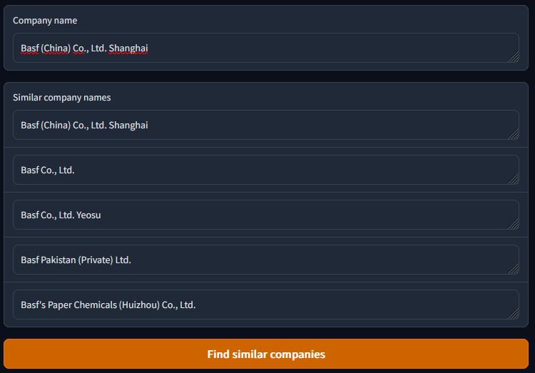

# Check Same Corporation
## About
Check Same Corporation is a project that will allow you to determine whether two names belong to the same company.  
For the development of this project, both general techniques from NLP and machine learning are used.  
Also, for ease of use, a web interface has been developed!

  

---

### Installation
In order to run inference you need to install the necessary dependencies:
```
pip install -r requirements.txt
```

---

## Inference
To launch inference run the server script:
```bash
python src/server.py
```

---

## License
[MIT](https://choosealicense.com/licenses/mit/)
